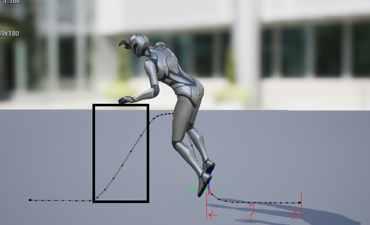

Проект реализован полностью на С++. Единственный момент это выдача Ability в BP, т.к. пути монтажей пришлось бы хардкодить.

С чем были проблемы: анимации паркура были "привязаны" к скилету из 5.5. Я пробовал 5.4\5.7 - анимации не появлялись, пришлось скачивать 5.5

Что можно улучшить: vault и mantle на одну\две клавиши - выглядит странно. Лучше всего сделат одну клавишу для mantle и автоматический vault со сменой быстрой анимации по скорости или модификатору(Shift) 

Замечание: анимация для быстрого vaulting имеет очень длинное начало, в сравнении с обычной версией. Я обрезал начало где то 10 кадров, иначе персонаж на скорости "нырял" в препядствие

